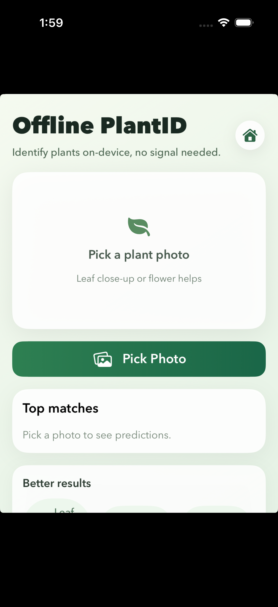
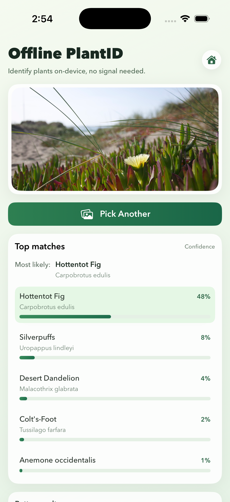

# Offline PlantID

SwiftUI + iOS 15+ offline plant classifier using the Nature Explorer plants model.

<p align="center">
  
  
  
</p>

## What you need
- macOS with Xcode 14+ installed
- An iPhone or iOS simulator
- This repo checked out locally

## Quick start
1) Run `pod install` in the repo root.
2) Open `Offline PlantID.xcworkspace` in Xcode.
3) Select a device/simulator and run.

## Model + labels (already included)
These files are bundled as app resources via `project.yml`:
- `inat_models/inat_plant.tflite`
- `inat_models/aiy_plants_V1_labelmap.csv`

## Get the TFLite model file
The `.tflite` model file is not checked into git. Download it from Kaggle and place it at:
- `inat_models/inat_plant.tflite`

Model source:
https://www.kaggle.com/models/google/aiy/tensorFlow1/vision-classifier-plants-v1/1

## TensorFlow Lite Swift dependency
This project uses CocoaPods. The `Podfile` includes:
- `TensorFlowLiteSwift`

## Regenerate the project (if needed)
If you modify `project.yml`, regenerate the Xcode project:

```sh
xcodegen
```

## Troubleshooting
- If the model fails to load, confirm the resource filenames in `Sources/ModelDataHandler.swift`.
- If you see empty predictions, confirm you picked a clear plant photo and try again.
